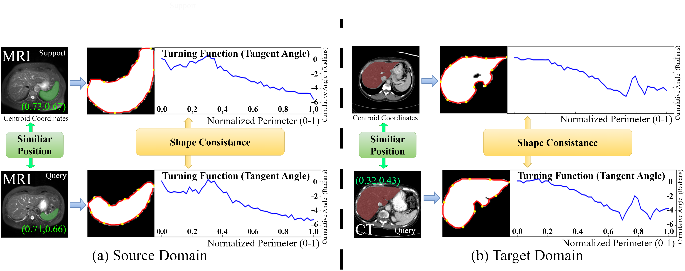
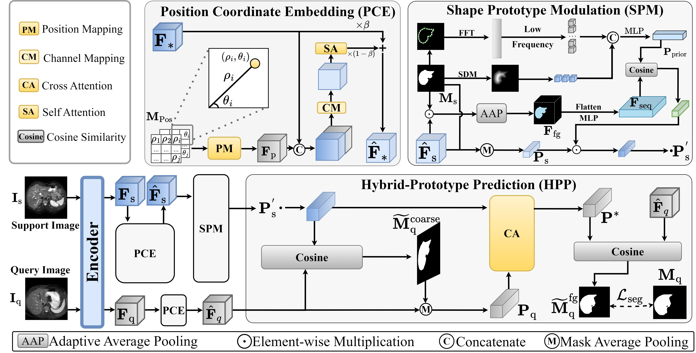
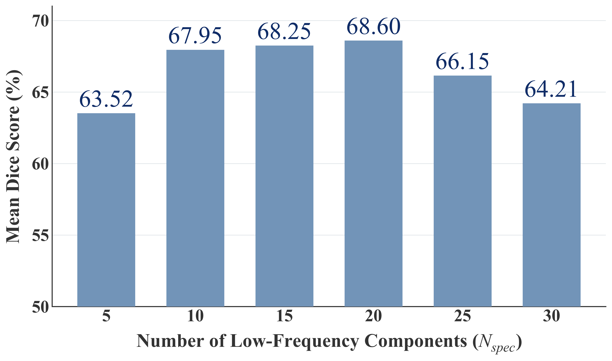
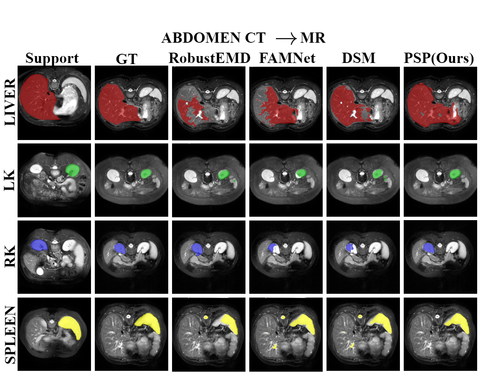
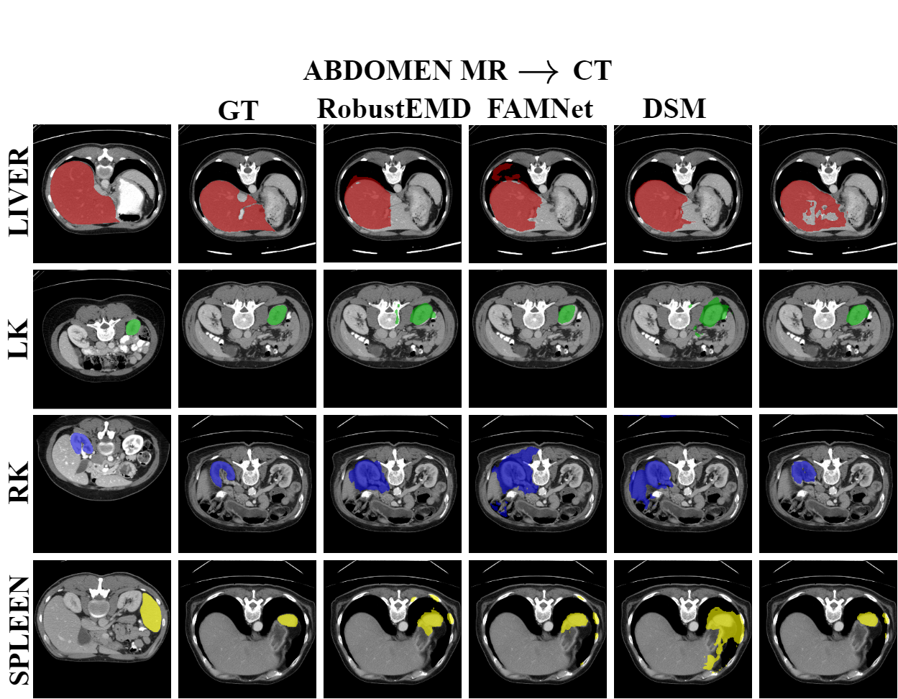
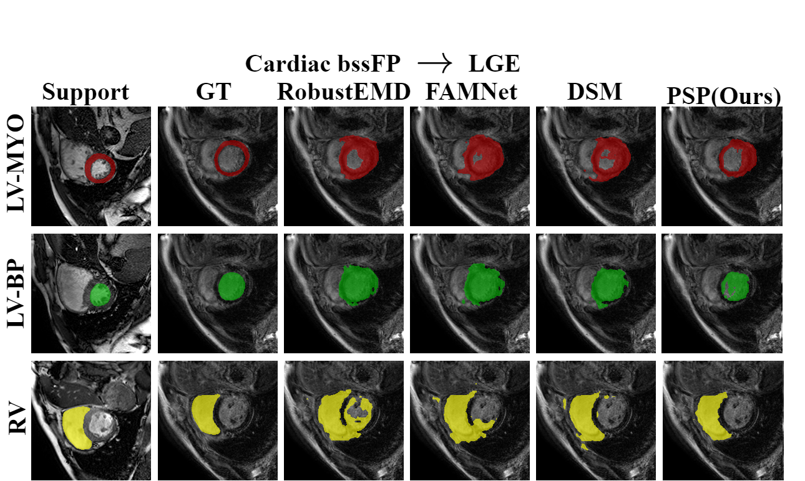
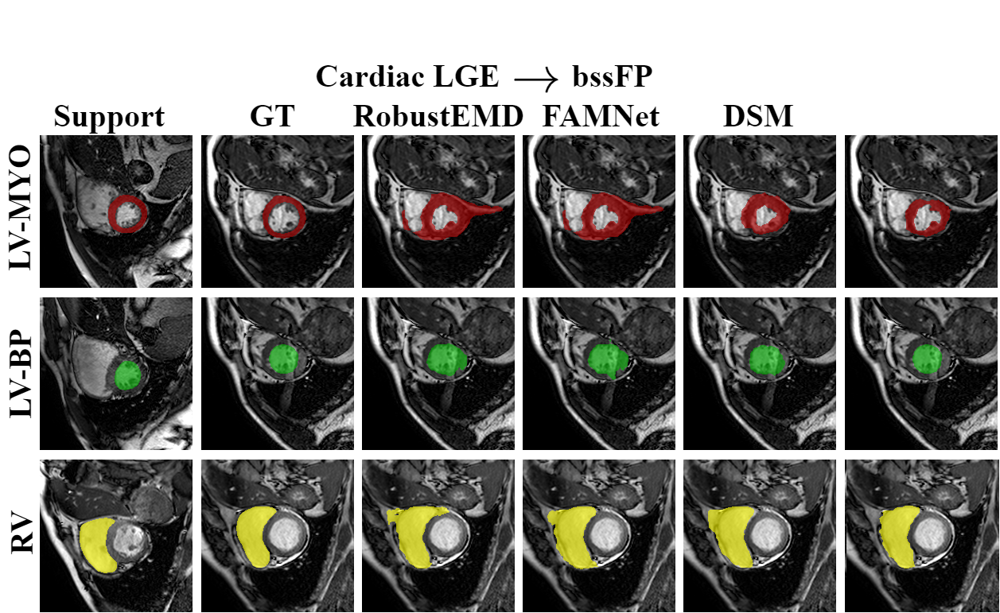

# PSP: Harnessing Position and Shape Priors for Cross-Domain Few-Shot Medical Image Segmentation

## 🚩Abstract
Few-Shot Medical Image Segmentation (FSMIS) offers a powerful solution to data scarcity but struggles to generalize across different imaging modalities. This performance collapse stems primarily from the drastic texture discrepancies between domains, which mislead models trained on source-specific intensity distributions. While existing methods attempt to align frequency or local texture features, they often fail to decouple semantic structure from domain-specific appearance. To address this, we identify a critical invariance: despite distinct imaging physics, the position and geometric shape of organs remain robustly consistent across modalities. Therefore, we propose a novel framework that harnesses Position and Shape Priors (PSP) for cross-domain FSMIS. Specifically, PSP first introduces a Position Coordinate Embedding (PCE) module to inject relative spatial coordinates for rapid organ localization. Subsequently, a Shape Prototype Modulation (SPM) module constructs domain-invariant structural prototypes via explicit shape priors, effectively filtering out texture noise. Furthermore, the Hybrid-Prototype Prediction (HPP) module adaptively calibrates the support prototype to the query feature distribution, mitigating feature misalignment. Extensive experiments on two public medical imaging datasets demonstrate that PSP significantly outperforms state-of-the-art methods.


## 💡Motivation
<!-- 这是一张图片，ocr 内容为： -->


We observe a key medical characteristic: although imaging textures vary drastically across modalities, the anatomical position and geometric shape of the same organ remain highly consistent between support and query images. This indicates that position and shape serve as ideal "cross-domain invariants". Effectively harnessing these anatomical priors can guide the model to break free from excessive reliance on domain-specific features, thereby achieving robust segmentation. Regardless of the domain, the support and query images exhibit high consistency in position (centroid coordinates) and shape (visualized by Turning Functions).

## 🔍Overview of PSP
<!-- 这是一张图片，ocr 内容为： -->


## 🗝️Quick start
### 🔖1. Dependencies
Please install the following dependencies:

```python
dcm2nii
json5==0.8.5
jupyter==1.0.0
nibabel==2.5.1
numpy==1.24.4
opencv_python==4.11.0.86
Pillow>=8.1.1
sacred==0.8.7
scikit_learn==1.3.2
scikit-image==0.18.3
SimpleITK==2.5.2
torch==2.4.1
torchvision==0.19.1
matplotlib==3.7.5
scipy==1.16.0
```

### 📋2. Datasets and Pre-processing
1. Download Datasets:
+ Abdomen MRI：[Combined Healthy Abdominal Organ Segmentation dataset](https://chaos.grand-challenge.org/)
+ Abdomen CT：[Multi-Atlas Abdomen Labeling Challenge](https://www.synapse.org/#!Synapse:syn3193805/wiki/218292)
+ <font style="color:rgb(31, 35, 40);">Cardiac LGE and b-SSFP</font>：[Multi-sequence Cardiac MRI Segmentation dataset](https://zmiclab.github.io/zxh/0/mscmrseg19/index.html)
+ <font style="color:rgb(31, 35, 40);">Prostate UCLH and NCI</font>：[Cross-institution Male Pelvic Structures](https://zenodo.org/records/7013610)
2. Data Pre-processing:
+ <font style="color:rgb(31, 35, 40);">Pre-processing is performed according to </font>[<font style="color:rgb(9, 105, 218);">Ouyang et al.</font>](https://github.com/cheng-01037/Self-supervised-Fewshot-Medical-Image-Segmentation/tree/2f2a22b74890cb9ad5e56ac234ea02b9f1c7a535)<font style="color:rgb(31, 35, 40);"> and we follow the procedure on their GitHub repository.</font>
3. Directory Structure: The final data should be stored in the `./data` directory. The structure is as follows:

```python
./data
├── ABD
│   ├── ABDOMEN_CT
│   │   ├── sabs_CT_normalized
│   │   └── supervoxels_5000
│   └── ABDOMEN_MR
│       ├── chaos_MR_T2_normalized
│       └── supervoxels_5000
├── Cardiac
│   ├── bSSFP
│   │   ├── cmr_bssFP_normalized
│   │   └── supervoxels_5000
│   ├── LGE
│   │   ├── cmr_LGE_normalized
│   │   └── supervoxels_5000
├── Prostate
│   ├── NCI
│   │   ├── tcia_p3t_normalized
│   │   └── supervoxels_......
│   └── UCLH
│       ├── biopsy_normalized
│       └── supervoxels_.......

```

<font style="color:rgb(31, 35, 40);"></font>

### 📍Download ResNet Pre-trained Weights
| resnet50-imagenet | [https://download.pytorch.org/models/resnet50-19c8e357.pth](https://download.pytorch.org/models/resnet50-19c8e357.pth) |
| --- | --- |
| resnet50-coco | [https://download.pytorch.org/models/deeplabv3_resnet50_coco-cd0a2569.pth](https://download.pytorch.org/models/deeplabv3_resnet50_coco-cd0a2569.pth) |
| resnet101-imagenet | [https://download.pytorch.org/models/resnet101-63fe2227.pth](https://download.pytorch.org/models/resnet101-63fe2227.pth) |
| resnet101-coco | [https://download.pytorch.org/models/deeplabv3_resnet101_coco-586e9e4e.pth](https://download.pytorch.org/models/deeplabv3_resnet101_coco-586e9e4e.pth) |


1. Download the [resnet50-coco](https://download.pytorch.org/models/resnet101-63fe2227.pth) weights as our pre-trained model.
2. Create a `checkpoint` directory and place the downloaded model inside it. The directory structure should look like this:

```python
\checkpoint
└── deeplabv3_resnet50_coco-cd0a2569.pth
```

### 🔥Training and Inference
There are 6 training tasks:

1. Abdomen CT (train)-> MR(inference)
2. Abdomen MR (train)-> CT(inference)
3. Cardiac LGE(train) -> bSSFP(infernce)
4. Cardiac bSSFP (train) -> LGE(inference)
5. Prostate NCI (train) -> UCLH(inference)
6. Prostate UCLH (train) -> NCI (inference)


The training and inference commands for each task are listed in the table below:

| | Task | Training Command | Inference Command |
| --- | --- | --- | --- |
| 1.  | CT-> MR | ./scripts/train_on_ABDOMEN_CT.sh | ./scripts/test_ABDOMEN_CT2MR.sh |
| 2.  | MR->CT | ./scripts/train_on_ABDOMEN_MR.sh | ./scripts/test_ABDOMEN_MR2CT.sh |
| 3.  | LGE -> bSSFP | ./scripts/train_on_Cardiac_LGE.sh | ./scripts/test_Cardiac_LGE2bssFP.sh |
| 4.  | bSSFP -> LGE | ./scripts/train_on_Cardiac_bSSFP.sh | ./scripts/test_Cardiac_bssFP2LGE.sh |
| 5.  | NCI -> UCLH | ./scripts/train_on_Prostate_NCI.sh | ./scripts/test_Prostate_NCI2UCLH.sh |
| 6.  | UCLH -> NCI | ./scripts/train_on_Prostate_UCLH.sh | ./scripts/test_Prostate_UCLH2NCI.sh |


Taking CT->MR as an example:

Training：

```python
./scripts/train_on_ABDOMEN_CT.sh # Ensure the file has execution permissions
```

Inference：

```python
./scripts/test_ABDOMEN_CT2MR.sh
```

## Experiment

### Quantitative Comparison on Cross-Modality Dataset

<p>Comparison of different methods in Dice scores (%). <br>
<b>Bold</b>: Best results; <u>Underlined</u>: Second best results.</p>
<table>
<thead>
  <tr>
    <th rowspan="2">Method</th>
    <th rowspan="2">Ref.</th>
    <th colspan="5" align="center"><b>Abd CT → MRI</b></th>
    <th colspan="5" align="center"><b>Abd MRI → CT</b></th>
  </tr>
  <tr>
    <th>Liver</th>
    <th>LK</th>
    <th>RK</th>
    <th>Spleen</th>
    <th>Mean</th>
    <th>Liver</th>
    <th>LK</th>
    <th>RK</th>
    <th>Spleen</th>
    <th>Mean</th>
  </tr>
</thead>
<tbody>
  <tr>
    <td>SSL-ALP</td>
    <td>TMI'22</td>
    <td>70.74</td>
    <td>55.49</td>
    <td>67.43</td>
    <td>58.39</td>
    <td>63.01</td>
    <td>71.38</td>
    <td>34.48</td>
    <td>32.32</td>
    <td>51.67</td>
    <td>47.46</td>
  </tr>
  <tr>
    <td>ADNet</td>
    <td>MIA'22</td>
    <td>50.33</td>
    <td>39.36</td>
    <td>37.88</td>
    <td>39.37</td>
    <td>41.73</td>
    <td>64.25</td>
    <td>37.39</td>
    <td>25.62</td>
    <td>42.94</td>
    <td>42.55</td>
  </tr>
  <tr>
    <td>PATNet</td>
    <td>ECCV'22</td>
    <td>57.01</td>
    <td>50.23</td>
    <td>53.01</td>
    <td>51.63</td>
    <td>52.97</td>
    <td><u>75.94</u></td>
    <td>46.62</td>
    <td>42.68</td>
    <td>63.94</td>
    <td>57.29</td>
  </tr>
  <tr>
    <td>CATNet</td>
    <td>MICCAI'23</td>
    <td>44.58</td>
    <td>43.67</td>
    <td>50.27</td>
    <td>46.34</td>
    <td>46.21</td>
    <td>54.52</td>
    <td>41.73</td>
    <td>40.24</td>
    <td>45.84</td>
    <td>45.60</td>
  </tr>
  <tr>
    <td>RPT</td>
    <td>MICCAI'23</td>
    <td>49.22</td>
    <td>42.45</td>
    <td>47.14</td>
    <td>48.84</td>
    <td>46.91</td>
    <td>65.87</td>
    <td>40.07</td>
    <td>35.97</td>
    <td>51.22</td>
    <td>48.28</td>
  </tr>
  <tr>
    <td>IFA</td>
    <td>CVPR'24</td>
    <td>48.81</td>
    <td>45.79</td>
    <td>51.46</td>
    <td>51.42</td>
    <td>49.37</td>
    <td>50.05</td>
    <td>36.45</td>
    <td>32.69</td>
    <td>43.08</td>
    <td>40.57</td>
  </tr>
  <tr>
    <td>RobustEMD</td>
    <td>AIIM'25</td>
    <td>60.16</td>
    <td><u>66.34</u></td>
    <td>70.26</td>
    <td>53.71</td>
    <td>62.61</td>
    <td>69.82</td>
    <td><u>63.79</u></td>
    <td>50.34</td>
    <td>59.88</td>
    <td>60.95</td>
  </tr>
  <tr>
    <td>FAMNet</td>
    <td>AAAI'25</td>
    <td><b>73.01</b></td>
    <td>57.28</td>
    <td><u>74.68</u></td>
    <td>58.21</td>
    <td><u>65.79</u></td>
    <td>73.57</td>
    <td>57.79</td>
    <td><u>61.89</u></td>
    <td><u>65.78</u></td>
    <td><u>64.75</u></td>
  </tr>
  <tr>
    <td>DSM</td>
    <td>TIP'25</td>
    <td><u>72.94</u></td>
    <td>61.59</td>
    <td>69.52</td>
    <td><b>59.00</b></td>
    <td>65.76</td>
    <td><b>77.69</b></td>
    <td>56.60</td>
    <td>56.45</td>
    <td>59.63</td>
    <td>62.59</td>
  </tr>
  <tr>
    <td><b>PSP(Ours)</b></td>
    <td>-</td>
    <td>70.24</td>
    <td><b>69.96</b></td>
    <td><b>78.70</b></td>
    <td><u>58.56</u></td>
    <td><b>69.36</b></td>
    <td>73.44</td>
    <td><b>64.48</b></td>
    <td><b>69.17</b></td>
    <td><b>65.91</b></td>
    <td><b>68.25</b></td>
  </tr>
</tbody>
</table>
<p>Comparison of Dice scores (%) on Cardiac dataset. <br>
<b>Bold</b>: Best results; <u>Underlined</u>: Second best results.</p>

### Quantitative Comparison on Cross-Sequence Dataset
<table>
<thead>
  <tr>
    <th rowspan="2">Method</th>
    <th rowspan="2">Ref.</th>
    <th colspan="4" align="center"><b>Cardiac LGE → b-SSFP</b></th>
    <th colspan="4" align="center"><b>Cardiac b-SSFP → LGE</b></th>
  </tr>
  <tr>
    <th>LV-BP</th>
    <th>LV-MYO</th>
    <th>RV</th>
    <th>Mean</th>
    <th>LV-BP</th>
    <th>LV-MYO</th>
    <th>RV</th>
    <th>Mean</th>
  </tr>
</thead>
<tbody>
  <tr>
    <td>SSL-ALP</td>
    <td>TMI'22</td>
    <td>83.47</td>
    <td>22.73</td>
    <td>66.21</td>
    <td>57.47</td>
    <td>65.81</td>
    <td>25.64</td>
    <td>51.24</td>
    <td>47.56</td>
  </tr>
  <tr>
    <td>ADNet</td>
    <td>MIA'22</td>
    <td>58.75</td>
    <td>36.94</td>
    <td>51.37</td>
    <td>49.02</td>
    <td>40.36</td>
    <td>37.22</td>
    <td>43.66</td>
    <td>40.41</td>
  </tr>
  <tr>
    <td>PATNet</td>
    <td>ECCV'22</td>
    <td>65.35</td>
    <td>50.63</td>
    <td>68.34</td>
    <td>61.44</td>
    <td>66.82</td>
    <td><u>53.64</u></td>
    <td>59.74</td>
    <td>60.06</td>
  </tr>
  <tr>
    <td>CATNet</td>
    <td>MICCAI'23</td>
    <td>64.63</td>
    <td>42.41</td>
    <td>56.13</td>
    <td>54.39</td>
    <td>45.77</td>
    <td>43.51</td>
    <td>46.02</td>
    <td>45.10</td>
  </tr>
  <tr>
    <td>RPT</td>
    <td>MICCAI'23</td>
    <td>60.84</td>
    <td>42.28</td>
    <td>57.30</td>
    <td>53.47</td>
    <td>50.39</td>
    <td>40.13</td>
    <td>50.50</td>
    <td>47.00</td>
  </tr>
  <tr>
    <td>IFA</td>
    <td>CVPR'24</td>
    <td>64.04</td>
    <td>43.22</td>
    <td>74.58</td>
    <td>62.28</td>
    <td>68.07</td>
    <td>36.07</td>
    <td>60.42</td>
    <td>54.85</td>
  </tr>
  <tr>
    <td>RobustEMD</td>
    <td>AIIM'25</td>
    <td>75.32</td>
    <td>51.32</td>
    <td>72.86</td>
    <td>66.50</td>
    <td>73.19</td>
    <td>50.02</td>
    <td>60.29</td>
    <td>61.16</td>
  </tr>
  <tr>
    <td>FAMNet</td>
    <td>AAAI'25</td>
    <td><u>86.64</u></td>
    <td><u>51.84</u></td>
    <td><u>76.26</u></td>
    <td>71.58</td>
    <td><b>77.37</b></td>
    <td>52.05</td>
    <td>54.75</td>
    <td>61.39</td>
  </tr>
  <tr>
    <td>DSM</td>
    <td>TIP'25</td>
    <td>85.27</td>
    <td>50.74</td>
    <td>73.20</td>
    <td><u>69.74</u></td>
    <td>71.27</td>
    <td>53.62</td>
    <td><b>63.65</b></td>
    <td><u>62.85</u></td>
  </tr>
  <tr>
    <td><b>PSP(Ours)</b></td>
    <td>-</td>
    <td><b>90.26</b></td>
    <td><b>61.30</b></td>
    <td><b>84.33</b></td>
    <td><b>78.63</b></td>
    <td><u>74.51</u></td>
    <td><b>56.41</b></td>
    <td><u>62.10</u></td>
    <td><b>64.34</b></td>
  </tr>
</tbody>
</table>


## Ablation
Unless otherwise specified, all our experiments were conducted on the task Abd-MR -> Abd-CT.

### Effect of each module.
| PCE | SPM | HPP | Mean Dice (%) |
| --- | --- | --- | --- |
| | | | 62.08 |
| ✔️ | | | 63.45 |
| ✔️ | ✔️ | | 66.71 |
| ✔️ | ✔️ | ✔️ | **68.25** |


### Effect of the number of low frequency components.
<!-- 这是一张图片，ocr 内容为： -->



## Visualization
To demonstrate the superiority of our model, we compared the visual segmentation results of [<font style="color:rgb(9, 105, 218);">RobustEMD</font>](https://github.com/YazhouZhu19/RobustEMD)<font style="color:rgb(31, 35, 40);">, </font> [<font style="color:rgb(9, 105, 218);">FAMNet</font>](https://github.com/primebo1/FAMNet)<font style="color:rgb(31, 35, 40);">, </font> and [<font style="color:rgb(9, 105, 218);">DSM</font>](https://github.com/YazhouZhu19/DSM) with our PSP.
### Abd-CT -> Abd-MR


### Abd-MR -> Abd-CT
<!-- 这是一张图片，ocr 内容为： -->


### Cardiac-bssFP -> Cardiac-LGE
<!-- 这是一张图片，ocr 内容为： -->


### Cardiac-LGE -> Cardiac-bssFP
<!-- 这是一张图片，ocr 内容为： -->



## 🌹Acknowledgements
<font style="color:rgb(31, 35, 40);">Our code is built upon the works of </font>[<font style="color:rgb(9, 105, 218);">SSL-ALPNet</font>](https://github.com/cheng-01037/Self-supervised-Fewshot-Medical-Image-Segmentation)<font style="color:rgb(31, 35, 40);">, </font>[<font style="color:rgb(9, 105, 218);">ADNet</font>](https://github.com/sha168/ADNet)<font style="color:rgb(31, 35, 40);"> and </font>[<font style="color:rgb(9, 105, 218);">QNet</font>](https://github.com/ZJLAB-AMMI/Q-Net)<font style="color:rgb(31, 35, 40);">, we appreciate the authors for their excellent contributions!</font>

